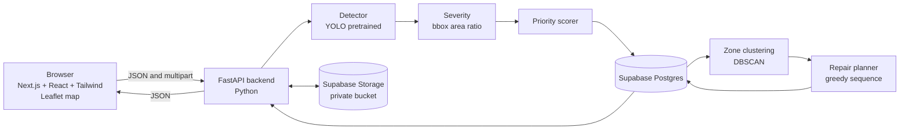

# 2. Technical Requirements Document (TRD)

**Project:** SRPPS | **Version:** 0.4 draft

Design rule: **working + understandable + defensible.** If two approaches work, pick the one the team can explain more easily.

---

## 1. Architecture



**Rule:** the browser talks only to the Python API. It never receives database credentials or the Supabase service key.

## 2. Stack (decided: Python backend, Next.js frontend, Supabase database)

| Layer | Choice | Why |
|---|---|---|
| Backend | Python 3 + FastAPI | Fast to build, auto API docs, same language as the ML code |
| DB access | SQLAlchemy 2 (Core) + psycopg 3, straight to the Postgres connection string | Plan generation and zone recompute need real multi-statement transactions, which the Supabase REST client does not give |
| Database | Supabase (hosted Postgres) | Shared by the whole team, real constraints, SQL editor, free tier |
| File storage | Supabase Storage (private bucket) | Images stay off our disks; backend serves them |
| Detection | Ultralytics YOLO (pretrained pothole weights) | Standard object detector, little setup |
| Clustering | scikit-learn DBSCAN | No need to pick cluster count, handles noise |
| Frontend | Next.js (App Router) + React + TypeScript + Tailwind CSS | Components, routing, and styling out of the box |
| Map | Leaflet through react-leaflet (browser only) | Free, no API key |
| Charts | Chart.js through react-chartjs-2 | Simple bar/line charts |
| Map tiles | OpenStreetMap (attribution shown) | Free, no API key |

Versions installed and tested together in the skeleton: Python 3.12, Node 22, Next 16.4, React 19.3, Tailwind 4, FastAPI 0.143, SQLAlchemy 2.1, psycopg 3.3 (exact pins in `backend/requirements.txt` and `frontend/package.json`). Next 16 is newer than many tutorials; the generated `frontend/AGENTS.md` tells you to check the docs shipped in `node_modules/next/dist/docs/` when an API looks different.

Simpler alternative: SQLite and plain HTML. Trade-off we accepted: Supabase needs internet (or a local Postgres/Supabase for the demo, see the implementation plan risks), in exchange for a shared hosted database.

## 3. Modules

Full folder tree and conventions: `docs/07-project-structure.md`. Layering rule: **routers** (HTTP only) call **services** (the logic in section 4) call **repositories** (SQL).

| Module | File |
|---|---|
| API routes | `backend/app/api/routers/*.py` |
| Detector | `backend/app/services/detector.py` |
| GPS | `backend/app/services/gps.py` |
| Geo (haversine) | `backend/app/services/geo.py` |
| Severity | `backend/app/services/severity.py` |
| Priority | `backend/app/services/priority.py` |
| Duplicate/repeat matching | `backend/app/services/matching.py` |
| Zones | `backend/app/services/zones.py` |
| Planner | `backend/app/services/planner.py` |
| Status changes | `backend/app/services/status.py` |
| Storage | `backend/app/services/storage.py` |
| DB connection and transactions | `backend/app/core/db.py` |
| Pages (routes) | `frontend/src/app/` |
| Components | `frontend/src/components/` |
| API client and types | `frontend/src/lib/` |

## 4. Algorithms

All constants below live in the `config` table so they can be tuned without code changes. Values are **assumptions** until tested on real data.

### 4.1 Detection
- Run the model on the uploaded image. Keep detections with confidence ≥ `MIN_CONFIDENCE` (assumption: 0.40).
- Each kept detection becomes one pothole record (box in pixels plus confidence).
- Confidence is used **only to filter detections** and is stored for display. It does not change the severity score.

### 4.2 Severity
```
area_ratio     = (bbox_w * bbox_h) / (image_w * image_h)
severity_score = min(area_ratio / AREA_RATIO_MAX, 1.0)   # AREA_RATIO_MAX default 0.10
level          = Low    if score < SEV_MEDIUM_MIN        # default 0.30
                 Medium if score < SEV_HIGH_MIN          # default 0.60
                 High   otherwise
```
All the capitalised names are rows in the `config` table; the numbers shown are the seed defaults.
Limitation: a pothole closer to the camera looks bigger. Tell judges this is a relative 2D estimate. If time allows, a depth dataset (PothRGBD) could improve it.

### 4.3 Traffic and road importance
- `road_type` (highway, arterial, collector, local) maps to `importance_score`: 1.0 / 0.8 / 0.5 / 0.3 (assumption).
- `traffic_score` (0 to 1) is stored per road. **Mock data**, editable, labelled as such in the UI.
- Reporter picks the road name and type on upload (avoids reverse-geocoding dependencies).

### 4.4 Duplicate matching and repeat damage

**Location precision.** Every pothole found in one photo inherits that photo's single GPS point, and phone GPS is typically off by roughly 5 to 10 m (assumption; depends on device). So the system cannot tell apart potholes closer together than that, and does not try to. The map spreads overlapping markers slightly for display only (nothing stored).

Rules for image uploads (`DEDUP_RADIUS_M` assumption: 15 m, set above typical GPS error):
1. **Potholes in the same upload are always separate records.** They are never merged with each other.
2. **Match against open potholes from other uploads** (status not Repaired) inside the radius. All new detections share the photo's point, so distance is the same for each; only candidates inside the radius are considered. Matching is one-to-one: sort new detections by severity score (high first), sort candidates by severity score (high first), and pair them in order. An existing pothole matches at most one new detection.
   - Matched: same pothole. `detection_count += 1`, `last_detected_at` updated, keep the higher severity values.
3. **Match leftovers against Repaired potholes** in the radius, one-to-one the same way. Matched: create a new pothole with `recurrence_count = old.recurrence_count + 1` (damage came back).
4. Anything still unmatched is a brand-new pothole.

```
repeat_count = (detection_count - 1) + recurrence_count
repeat_score = min(repeat_count / REPEAT_CAP, 1.0)       # REPEAT_CAP default 3
```

### 4.5 Priority score
```
priority = W_SEVERITY*severity_score
         + W_TRAFFIC*traffic_score
         + W_IMPORTANCE*importance_score
         + W_REPEAT*repeat_score
         + W_FACILITY*facility_score      # defaults 0.40 / 0.20 / 0.15 / 0.10 / 0.15 (v0.5)
facility_score = exp(-distance_m / FACILITY_DECAY_M)   # nearest hospital, clinic, school or fire station
                                                         # (OpenStreetMap), FACILITY_DECAY_M default 500
band     = Critical if priority >= BAND_CRITICAL (0.70)
           Moderate if priority >= BAND_MODERATE (0.40)
           Low      otherwise
```
Weights must sum to 1.0 (checked at startup and on every config update, tolerance 0.001). The same formula is modelled in `pothole_hackathon_plan.xlsx` for easy tuning.

**Why these weights (v0.5).** The location factor (problem statement: "location") was added after v0.4. The weights were chosen so two checks hold, both unit-tested: a fully severe highway pothole is Critical (0.73), and a medium pothole right next to a hospital on a local road (0.435) outranks a small one on the highway (0.41). The cost: the facility factor only wins that comparison within about 100 m of the facility.

**Score ceilings (read this before the demo).** With the seeded demo roads, the highest score a pothole can reach (severity 1.0, repeat 1.0) is:

| Road type | Importance | Traffic (mock) | Max, no facility near | Max, next to a facility | Can be Critical? |
|---|---|---|---|---|---|
| highway | 1.0 | 0.90 | 0.830 | 0.980 | yes |
| arterial | 0.8 | 0.70 | 0.760 | 0.910 | yes |
| collector | 0.5 | 0.60 | 0.695 | 0.845 | only with repeats or a facility near |
| local | 0.3 | 0.20 | 0.585 | 0.735 | **only next to a facility** |

This is **intended**: a quiet local street should not outrank a busy road unless something critical is next to it. Judges may ask; the answer is "priority is about impact, not only damage."

**Optional safety override (off by default).** Priority is not the same as danger: a very dangerous pothole on a quiet street should not be easy to ignore. If `SAFETY_FLOOR_SEVERITY` is set above 0 (for example 0.90), any pothole with `severity_score` at or above it is shown as **Critical** regardless of its priority score, and the score breakdown says "safety override". The score itself is not changed. Default is 0 (disabled), so the demo behaves as described above until the team decides.

### 4.6 Maintenance zones
- Cluster **open** potholes (Pending, Scheduled, In Progress) by GPS with DBSCAN, haversine metric, `eps = ZONE_EPS_M / 6371000` radians, `min_samples = 2` (assumption: `ZONE_EPS_M` = 200).
- Noise points (no neighbours) each become a one-pothole zone.
- Zone score = average priority of its member potholes.
- Zones are **derived data**. Recompute runs in one transaction: delete all zones (the foreign key sets every `potholes.zone_id` to NULL), insert the new ones, assign `zone_id`. Nothing else in the database points at a zone, so nothing can dangle.
- Recompute runs when the user clicks Recompute and automatically at the start of every plan. The Zones page shows the time of the last recompute (`zones.created_at`).

### 4.7 Repair planning
Inputs: the `crews` table (each crew has `capacity_per_day`), `days` (how many days to plan), optional `start_date` (default today). Total capacity = sum over crews of `capacity_per_day * days`.

1. Reset any earlier plan: potholes that are **Scheduled** go back to **Pending** and their repair orders are deleted. **In Progress** potholes are left alone and not counted.
2. Recompute zones (4.6).
3. **Priority decides what is repaired:** day 1 takes the highest-priority Pending potholes, as many as all crews can repair in a day; day 2 the next ones; and so on.
4. **Location decides how crews drive:** each day's potholes are grouped by zone. Zones go, most urgent first, to the crew with the most capacity left that day (ties: lowest crew id); a zone is split only when it doesn't fit. Inside a zone, stops are ordered greedily: start with the highest priority, then repeatedly take the best `priority / (1 + distance_km)` from the last stop.
5. Per crew, `sequence_no` counts 1, 2, 3, ... across days; `planned_date` is the day.
6. Each scheduled pothole becomes **Scheduled** and gets one repair order.

**Revised in v0.5 after measuring it (4.10).** v0.4 ranked whole zones by their average priority and gave each zone to one crew. The evaluation showed one big zone of minor potholes delaying a Critical pothole elsewhere (80% vs 100% of Critical fixed on day 1 on 58 real uploads) and more travel than plain priority order. A regression test keeps that case fixed.

Edge cases:
- If `days * total capacity` is smaller than the Pending count, the lowest-priority potholes are left out. The response lists `unscheduled_count` and the ids, and the UI shows a banner.
- No crews, or total capacity 0: respond 400 "Add at least one crew".
- No Pending potholes: respond 200 with an empty plan and a "nothing to plan" message.

Trade-off: not optimal like a full travelling-salesman solution, but fast and explainable in 30 seconds.

### 4.10 Evaluating the prioritization
`GET /api/evaluation` (Evaluation page) simulates, without saving anything, the same crews and days on the open potholes under five strategies: SRPPS (the planner above), priority only (no zones), first come first served, severity only, and random (seed 42). Metrics: share of total priority repaired; % of Critical potholes repaired within X days; average repair day of Critical potholes (not repaired = days + 1); road-user exposure = sum of traffic x severity x days open (not repaired = days + 1) and its change vs first come first served; crew travel km (straight line between consecutive stops each day). Sensitivity: each weight -20% and +20% (all weights rescaled to sum to 1), with top-N overlap and Spearman correlation against the base ranking.

Caveat: exposure uses traffic and severity, which are also priority inputs, so priority-based strategies are expected to win on it; the evaluation shows by how much, and what it costs in travel.

### 4.8 Video (P2)
Sample one frame every `FRAME_INTERVAL_S` (assumption: 1 s). Save each frame that has detections to `uploads/<upload_id>/frame_<n>.jpg` and record `frame_index`, `frame_time_s`, and `frame_path` on the pothole. The same physical pothole shows up in consecutive frames, so for video only: merge detections in consecutive sampled frames when the box overlap (IoU) is at least `VIDEO_IOU_MIN` (assumption: 0.30), keeping the highest-confidence detection. Cross-upload matching (4.4) then applies as usual. Location is the single coordinate the user gives for the clip, so all potholes from one clip share it. Limitation: if the camera moves fast, box overlap merging is unreliable. Video is P2; nothing else depends on it.

### 4.9 Status model

**One source of truth: `potholes.status`** (Pending, Scheduled, In Progress, Repaired). `repair_orders` has no status column; an order is "done" when `completed_at` is set. Allowed changes:

| From | To | Trigger | Side effects |
|---|---|---|---|
| Pending | Scheduled | Plan generated | Create repair order |
| Scheduled | Pending | Replan, or user clicks Unschedule | Delete the order |
| Pending / Scheduled | In Progress | User clicks Start | Keep order if one exists |
| Pending / Scheduled / In Progress | Repaired | User clicks Done | Set `repaired_at`; set `completed_at` on the order if one exists |
| Repaired | (none) | Final in v0.2 | A returning pothole is a **new** record (4.4 rule 3) |

Any other change returns 409 `{ "error": "Invalid status change" }`. There is no undo for Repaired in v0.2; fix mistakes in the database by hand and note it.

## 5. API

Base path `/api`. JSON unless noted. Status rules are in 4.9.

| Method | Path | Purpose |
|---|---|---|
| POST | `/uploads` | Multipart: `file`, `lat`, `lng` (optional if EXIF), `road_name`, `road_type`. Runs detection, saves potholes, returns `upload_id`, image size, and potholes with boxes |
| GET | `/uploads/{id}/image` | The uploaded file (binary) |
| GET | `/potholes` | List, filters: `status`, `band`, `zone_id`. Includes box and image size |
| GET | `/potholes/{id}` | One pothole with score breakdown and box |
| GET | `/potholes/{id}/image` | The image the pothole was detected in (upload image, or saved video frame). The client draws the box on a canvas using the box fields |
| PATCH | `/potholes/{id}/status` | Body `{ "status": "Repaired" }`. 409 if the change is not allowed |
| GET | `/roads` | List roads with mock traffic and importance |
| PUT | `/roads/{id}` | Edit `traffic_score`, `importance_score`; recomputes priority |
| GET | `/crews` | List crews |
| POST | `/crews` | Body `{ "name": "Crew A", "capacity_per_day": 5 }` |
| PUT | `/crews/{id}` | Edit name or capacity |
| DELETE | `/crews/{id}` | 409 if the crew still has open orders |
| POST | `/zones/recompute` | Rebuild zones (4.6) |
| GET | `/zones` | Zones with member counts, average priority, `computed_at` |
| POST | `/plan` | Body `{ "days": 3, "start_date": "YYYY-MM-DD" }` (`start_date` optional). Uses all crews in the table. Returns `scheduled` orders, `unscheduled_count`, `unscheduled_ids` |
| GET | `/repairs` | Repair orders joined with pothole status; filter by `status`, `crew_id` |
| GET | `/analytics/summary` | Counts, top roads, repeat hotspots, time to repair |
| GET | `/config` | Weights and thresholds |
| PUT | `/config` | Update; rejects weights that don't sum to 1.0 (tolerance 0.001) |

Errors: 400 invalid input, 404 not found, 409 conflict, 413 file too large, 422 detection failed. Responses use `{ "error": "message" }`.

## 6. Non-functional requirements

| Area | Requirement |
|---|---|
| Speed | Image processed in a few seconds on a laptop CPU (target, to be measured and reported honestly) |
| Upload limits | JPG/PNG, max 10 MB, max 4000 px longest side (resize before inference) |
| Reliability | One command to start each side (`uvicorn`, `npm run dev`); demo data seeded; clear error messages instead of crashes. Needs internet for Supabase and map tiles unless a local Postgres is used |
| Security | No secrets in Git. `.env` files in `.gitignore`, `.env.example` committed. The Supabase service key and database password live only in `backend/.env`; only `NEXT_PUBLIC_` variables reach the browser. RLS is on for every table. Validate file type, size, **and content** (the image must actually open with an image library). Save uploads under generated filenames, never the user's. Never trust filenames |
| Privacy | Photos may contain faces/plates. Note this in README; no personal data stored beyond the image |
| Portability | Runs on Windows/Mac/Linux with Python 3 and Node. Skeleton tested on Python 3.12 and Node 22 |

### 6.1 Supabase rules

- Use the **Session pooler** connection string for `DATABASE_URL`. The direct connection is IPv6-only on many plans and can fail on venue networks. The Transaction pooler needs `DB_USE_NULLPOOL=true` and no prepared statements.
- The database service key is used only by the backend, for Storage.
- Images are stored in a **private** bucket and served through the API, not through public bucket URLs.
- Every new table gets Row Level Security enabled in its migration.
- Schema changes are new numbered files in `supabase/migrations/`; applied files are never edited.

## 7. Testing

| Feature | Cases |
|---|---|
| Upload | Valid image, no GPS and no EXIF, bad file type, oversize file, image with no pothole |
| Detection | Pothole present, multiple potholes, water-filled pothole, night/blur image |
| Severity/priority | Unit tests: known inputs give known scores; weights sum to 1 |
| Database | Migrations apply cleanly on an empty database; constraints reject bad rows; analytics queries run (done once for the skeleton on Postgres 16, not yet on hosted Supabase) |
| Frontend | `npm run lint` and `npm run build` pass; every route loads; map renders in the browser only (no server-side rendering errors) |
| Ranking sanity | Hand-rank about 10 example potholes (mix of severity, road, repeats) before looking at scores; compare with the app's ranking and discuss any big disagreements. Record the result honestly |
| Duplicates and repeat | Several potholes in one photo stay separate; same spot uploaded twice merges one-to-one; same spot after repair creates a new record with recurrence 1; two uploads 20 m apart do not merge |
| Zones | Two close points cluster, a far point becomes its own zone |
| Planner | 1 crew vs 2 crews; capacity smaller than pending count (unscheduled reported); no crews (400); replanning twice gives the same result; zones recomputed before planning |
| Status | Every allowed change in 4.9 works with its side effect; every other change returns 409; Repaired sets `repaired_at` and the order's `completed_at` |
| Demo case | Full flow on prepared sample photos |

Rule: never claim something works without running it, and never invent test results.

## 8. External resources and licences

Verify each licence before relying on it; record the final list in the main README.

| Resource | Use | Licence note |
|---|---|---|
| Ultralytics YOLO | Detection | Open source (AGPL-3.0 as far as I know). Team must check the terms |
| Pothole datasets (e.g. Roboflow "PotholeDetectionYOLOv8", 1,446 images) | Fine-tuning/test images | That set lists CC BY 4.0. Check each dataset individually |
| Next.js, React, Tailwind CSS, react-leaflet, Chart.js | Frontend | Open source (MIT/BSD-style as far as I know); check each |
| Leaflet | Map | Open source (BSD-2) |
| OpenStreetMap tiles | Base map | ODbL, attribution required |
| FastAPI, SQLAlchemy, Pillow, scikit-learn | Backend/ML | Open source; check each (psycopg is LGPL as far as I know) |
| Supabase (hosted Postgres + Storage) | Database and file storage | A service with its own terms and free-tier limits; check before the demo |
| `create-next-app` output | Frontend base | Generated by the Next.js tool; list it in the README |

## 9. AI usage disclosure

Claude was used for planning and drafting these docs. Update this section (and the README "AI Usage" section) with any further significant AI help on code, tests, or debugging.

## 10. Known limitations (initial)

- Severity is relative and depends on camera distance/angle
- All potholes in one photo share that photo's GPS point; precision is limited by phone GPS (roughly 5 to 10 m)
- With the seeded mock data, a pothole on the local road cannot reach Critical (max 0.66)
- Video merging by box overlap is unreliable when the camera moves fast
- Needs internet for Supabase and OpenStreetMap tiles unless a local database is set up (untested)
- Zones use straight-line distance, not driving distance; a river or divided road can make nearby points far apart in practice
- The planner assumes a fixed number of repairs per crew per day, regardless of pothole size, road closures, or repair duration
- The priority score and its thresholds are unvalidated assumptions, not a road-safety standard
- Traffic and road importance are mock/lookup values
- Greedy sequencing is not globally optimal
- Model accuracy depends on training data; may miss pothole types it hasn't seen
