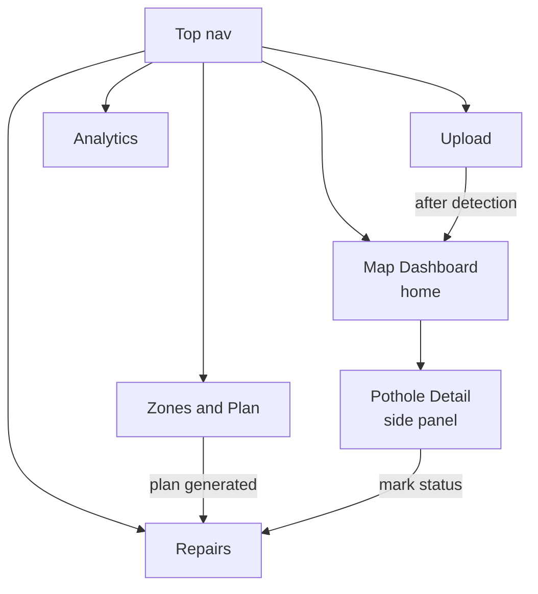
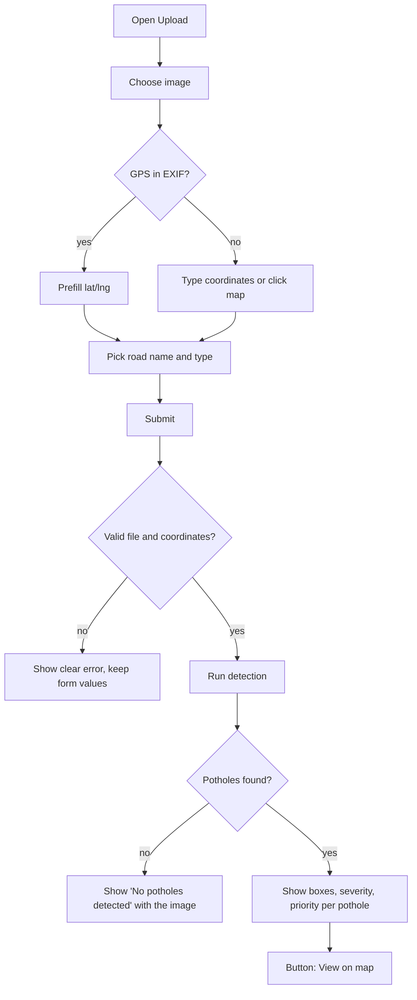
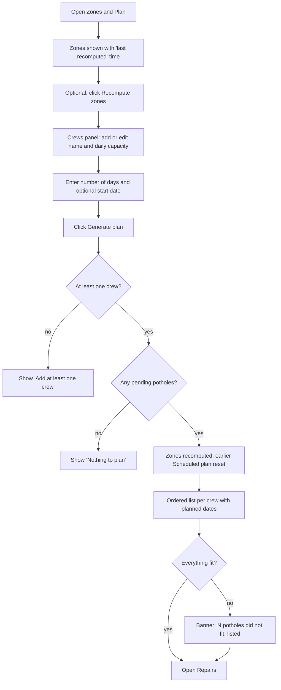

# 3. App Flow Document

**Project:** SRPPS | **Version:** 0.4 draft

No login. One app with five screens and one detail side panel, plus a top navigation bar.

---

## 1. Screen map

| Screen | Purpose | Key priority |
|---|---|---|
| Map Dashboard (home) | See all potholes by priority | P0 |
| Upload | Send image, set location and road | P0 |
| Pothole Detail (side panel) | Image, boxes, severity, score breakdown, status | P0 |
| Repairs | Pending vs done list, update status | P0 |
| Zones and Plan | See zones, enter crews, generate sequence | P1/P2 |
| Analytics | Charts and top-problem roads | P2 |

### Routes (Next.js App Router)

| URL | Screen | Folder |
|---|---|---|
| `/` | Map Dashboard (home) | `frontend/src/app/page.tsx` |
| `/upload` | Upload | `frontend/src/app/upload/` |
| `/zones-plan` | Zones and Plan | `frontend/src/app/zones-plan/` |
| `/repairs` | Repairs | `frontend/src/app/repairs/` |
| `/analytics` | Analytics | `frontend/src/app/analytics/` |

The Pothole Detail side panel is not a route. It opens when a marker is selected; the selected id can optionally live in the URL (for example `/?pothole=12`) so a view can be shared.

## 2. Flow A: Upload and detect (P0)

Behind the scenes after a successful detection: duplicate/repeat check (TRD 4.4), priority scoring, and save. Potholes found in the same photo share that photo's location, so precision is limited by GPS accuracy. Zones are refreshed when you open Zones and Plan and click Recompute, and automatically when you generate a plan.

## 3. Flow B: Review the map (P0)

1. Open the Map Dashboard. All non-repaired potholes load as markers.
2. Marker colour = priority band; marker size = priority score; hollow marker = repaired.
3. Filters: status, band, zone.
4. Click a marker: side panel shows the photo with the detected box drawn over it, severity level, score breakdown (severity, traffic, importance, repeat), status, first/last detected. Markers that share the same point are spread slightly for display only.
5. Buttons in the panel: set status (Scheduled, In Progress, Repaired).

## 4. Flow C: Zones and repair plan (P1/P2)

Notes: replanning is safe to repeat. Scheduled potholes go back to Pending and get scheduled again; In Progress potholes are untouched.

## 5. Flow D: Track repairs (P0)

1. Open Repairs. Tabs: Pending, Scheduled, In Progress, Repaired.
2. Each row: pothole id, road, band, zone, crew, planned date.
3. Row buttons depend on the status (rules in TRD 4.9):

| Current status | Buttons shown |
|---|---|
| Pending | Start, Mark repaired |
| Scheduled | Start, Mark repaired, Unschedule |
| In Progress | Mark repaired |
| Repaired | none (final; if damage returns, a new upload creates a new record) |

4. Marking repaired records the completion time and finishes the pothole's repair order if it has one.
5. Map and analytics reflect the change on next load.

## 6. Flow E: Analytics (P2)

Open Analytics to see: counts by status and severity, top roads by pending priority, repeat-damage hotspots, and average days from detection to repair. A table accompanies each chart so numbers can be read exactly.

## 7. States and errors

| Situation | What the user sees |
|---|---|
| Loading detection | Spinner and "Analyzing image…" |
| Unsupported file or too large | "Use a JPG or PNG under 10 MB" |
| No GPS found | Prompt to type coordinates or click the map |
| Coordinates out of range | Inline field error |
| No potholes detected | Message plus the original image, option to upload another |
| Server/model error | "Detection failed, try again" (no stack trace shown) |
| Empty map | "No potholes yet. Upload an image or load demo data" |
| Nothing to plan | "No pending potholes to schedule" |
| No crews defined | "Add at least one crew first" |
| Plan doesn't fit | Banner "N potholes didn't fit in the plan" with the list |
| Invalid status change | "That change isn't allowed from the current status" |

## 8. Demo path (sequence for judges)

1. Start on the Map Dashboard with seeded demo data.
2. Upload one fresh local photo, show boxes and score.
3. Show the same pothole location uploaded again, score rises (repeat).
4. Open Zones and Plan, recompute, use the 2 seeded crews, set the number of days, generate plan.
5. Mark one repair done, show map and analytics update.
