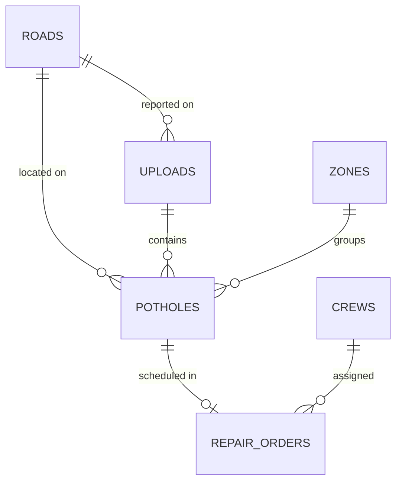

# 5. Backend Schema Document

**Project:** SRPPS | **Database:** Supabase (Postgres) | **Version:** 0.4 draft

The SQL in this document is copied from `supabase/migrations/` and `supabase/seed.sql`, which are the source of truth. It was run against PostgreSQL 16 for this document: the tables create, RLS switches on, the seed loads, constraints reject bad rows, and the analytics queries run. It has **not** been run on a hosted Supabase project yet.

Timestamps are `timestamptz` (UTC). Coordinates are WGS84 decimal degrees. Distances use the haversine formula in Python (PostGIS is not required).

---

## 1. Entity relationships



Zones are derived data and are rebuilt often, so only `potholes.zone_id` points at them (with `ON DELETE SET NULL`). Repair orders do not.

## 2. Tables at a glance

| Table | Purpose |
|---|---|
| `roads` | Road name, type, importance, mock traffic score |
| `uploads` | One row per uploaded image/video, with location and Storage path |
| `potholes` | One row per detected pothole with scores and status |
| `zones` | Maintenance zones from clustering |
| `crews` | Repair crews and daily capacity |
| `repair_orders` | Planned/finished repair tasks with sequence |
| `config` | Tunable weights and thresholds |

## 3. Migrations and Supabase setup

### 3.1 `supabase/migrations/0001_init_schema.sql`

```sql
-- SRPPS initial schema for Supabase Postgres.
-- Coordinates are WGS84 decimal degrees. Timestamps are timestamptz (UTC).
-- Distances are computed in Python (haversine); PostGIS is not required.

CREATE TABLE public.roads (
  road_id          BIGINT GENERATED ALWAYS AS IDENTITY PRIMARY KEY,
  name             TEXT NOT NULL,
  road_type        TEXT NOT NULL CHECK (road_type IN ('highway','arterial','collector','local')),
  importance_score DOUBLE PRECISION NOT NULL CHECK (importance_score BETWEEN 0 AND 1),
  traffic_score    DOUBLE PRECISION NOT NULL CHECK (traffic_score BETWEEN 0 AND 1),
  data_source      TEXT NOT NULL DEFAULT 'mock' CHECK (data_source IN ('mock','real')),
  UNIQUE (name, road_type)
);

CREATE TABLE public.uploads (
  upload_id    BIGINT GENERATED ALWAYS AS IDENTITY PRIMARY KEY,
  storage_path TEXT NOT NULL,                 -- object path in the private Storage bucket
  media_type   TEXT NOT NULL CHECK (media_type IN ('image','video')),
  lat          DOUBLE PRECISION NOT NULL CHECK (lat BETWEEN -90 AND 90),
  lng          DOUBLE PRECISION NOT NULL CHECK (lng BETWEEN -180 AND 180),
  gps_source   TEXT NOT NULL CHECK (gps_source IN ('exif','manual','map_click')),
  road_id      BIGINT REFERENCES public.roads(road_id),
  image_width  INTEGER,
  image_height INTEGER,
  captured_at  TIMESTAMPTZ,
  uploaded_at  TIMESTAMPTZ NOT NULL DEFAULT now()
);

CREATE TABLE public.zones (
  zone_id       BIGINT GENERATED ALWAYS AS IDENTITY PRIMARY KEY,
  centroid_lat  DOUBLE PRECISION NOT NULL,
  centroid_lng  DOUBLE PRECISION NOT NULL,
  pothole_count INTEGER NOT NULL DEFAULT 0,
  avg_priority  DOUBLE PRECISION NOT NULL DEFAULT 0,
  created_at    TIMESTAMPTZ NOT NULL DEFAULT now()
);

CREATE TABLE public.potholes (
  pothole_id         BIGINT GENERATED ALWAYS AS IDENTITY PRIMARY KEY,
  upload_id          BIGINT NOT NULL REFERENCES public.uploads(upload_id),
  road_id            BIGINT REFERENCES public.roads(road_id),
  zone_id            BIGINT REFERENCES public.zones(zone_id) ON DELETE SET NULL,
  frame_index        INTEGER,
  frame_time_s       DOUBLE PRECISION,
  frame_storage_path TEXT,
  lat                DOUBLE PRECISION NOT NULL CHECK (lat BETWEEN -90 AND 90),
  lng                DOUBLE PRECISION NOT NULL CHECK (lng BETWEEN -180 AND 180),
  bbox_x             DOUBLE PRECISION,
  bbox_y             DOUBLE PRECISION,
  bbox_w             DOUBLE PRECISION,
  bbox_h             DOUBLE PRECISION,
  confidence         DOUBLE PRECISION CHECK (confidence BETWEEN 0 AND 1),
  area_ratio         DOUBLE PRECISION CHECK (area_ratio BETWEEN 0 AND 1),
  severity_score     DOUBLE PRECISION NOT NULL DEFAULT 0 CHECK (severity_score BETWEEN 0 AND 1),
  severity_level     TEXT NOT NULL DEFAULT 'Low' CHECK (severity_level IN ('Low','Medium','High')),
  detection_count    INTEGER NOT NULL DEFAULT 1,
  recurrence_count   INTEGER NOT NULL DEFAULT 0,
  priority_score     DOUBLE PRECISION NOT NULL DEFAULT 0 CHECK (priority_score BETWEEN 0 AND 1),
  priority_band      TEXT NOT NULL DEFAULT 'Low' CHECK (priority_band IN ('Low','Moderate','Critical')),
  safety_override    BOOLEAN NOT NULL DEFAULT false,
  status             TEXT NOT NULL DEFAULT 'Pending'
                     CHECK (status IN ('Pending','Scheduled','In Progress','Repaired')),
  first_detected_at  TIMESTAMPTZ NOT NULL DEFAULT now(),
  last_detected_at   TIMESTAMPTZ NOT NULL DEFAULT now(),
  repaired_at        TIMESTAMPTZ
);

CREATE TABLE public.crews (
  crew_id          BIGINT GENERATED ALWAYS AS IDENTITY PRIMARY KEY,
  name             TEXT NOT NULL UNIQUE,
  capacity_per_day INTEGER NOT NULL CHECK (capacity_per_day > 0)
);

CREATE TABLE public.repair_orders (
  order_id     BIGINT GENERATED ALWAYS AS IDENTITY PRIMARY KEY,
  pothole_id   BIGINT NOT NULL UNIQUE REFERENCES public.potholes(pothole_id),
  crew_id      BIGINT NOT NULL REFERENCES public.crews(crew_id),
  sequence_no  INTEGER NOT NULL CHECK (sequence_no > 0),
  planned_date DATE NOT NULL,
  completed_at TIMESTAMPTZ,
  notes        TEXT,
  created_at   TIMESTAMPTZ NOT NULL DEFAULT now()
);

CREATE TABLE public.config (
  key   TEXT PRIMARY KEY,
  value TEXT NOT NULL
);

CREATE INDEX idx_potholes_status ON public.potholes(status);
CREATE INDEX idx_potholes_zone   ON public.potholes(zone_id);
CREATE INDEX idx_potholes_geo    ON public.potholes(lat, lng);
CREATE INDEX idx_potholes_road   ON public.potholes(road_id);
CREATE INDEX idx_orders_crew_seq ON public.repair_orders(crew_id, sequence_no);
```

### 3.2 `supabase/migrations/0002_enable_rls.sql`

```sql
-- Supabase exposes the public schema through its Data API. The browser never talks
-- to the database directly in SRPPS (it calls the Python API), so lock every table:
-- RLS on, no policies = the anon and authenticated roles can read and write nothing.
-- The Python backend connects with the database role (postgres), which bypasses RLS.

ALTER TABLE public.roads         ENABLE ROW LEVEL SECURITY;
ALTER TABLE public.uploads       ENABLE ROW LEVEL SECURITY;
ALTER TABLE public.zones         ENABLE ROW LEVEL SECURITY;
ALTER TABLE public.potholes      ENABLE ROW LEVEL SECURITY;
ALTER TABLE public.crews         ENABLE ROW LEVEL SECURITY;
ALTER TABLE public.repair_orders ENABLE ROW LEVEL SECURITY;
ALTER TABLE public.config        ENABLE ROW LEVEL SECURITY;
```

### 3.3 Setting up the project

1. Create a Supabase project in the dashboard.
2. Open the **SQL Editor** and run, in this order: `0001_init_schema.sql`, `0002_enable_rls.sql`, then `seed.sql`. (Using the Supabase CLI instead is fine; follow its docs.)
3. **Storage:** create a **private** bucket named `road-images`. The Python backend uploads and reads with the service key and serves images through its own `/image` endpoints. The browser never gets bucket access.
4. **Connection string:** dashboard, Connect, copy the **Session pooler** string into `backend/.env` as `DATABASE_URL`.
   - The direct connection (`db.<ref>.supabase.co`) is IPv6-only unless you buy the IPv4 add-on, so it can fail on venue or home networks.
   - The Session pooler (port 5432) works over IPv4 and keeps normal transactions and prepared statements.
   - The Transaction pooler (port 6543) works too, but set `DB_USE_NULLPOOL=true` and avoid prepared statements.
5. Keep the **service key** only in `backend/.env`. Never put it in the frontend.

Why RLS with no policies: Supabase exposes the `public` schema through its Data API. Locking every table means the public anon key can read and write nothing. The Python backend connects with the database role, which (as far as I know) bypasses RLS. Check this on your project. Every new table needs its own `ENABLE ROW LEVEL SECURITY`.

## 4. Seed data

Default config (all values are assumptions to tune), mock roads, and two crews. Every constant named in the TRD formulas is a row here, so none are hardcoded in code. Roads carry `data_source = 'mock'`.

```sql
-- Demo seed. Roads and traffic values are MOCK data; every road is labelled data_source = 'mock'.
-- All config values are assumptions to tune, not standards.

INSERT INTO public.config (key, value) VALUES
  ('W_SEVERITY',             '0.40'),
  ('W_TRAFFIC',              '0.25'),
  ('W_IMPORTANCE',           '0.20'),
  ('W_REPEAT',               '0.15'),
  ('MIN_CONFIDENCE',         '0.40'),
  ('AREA_RATIO_MAX',         '0.10'),
  ('SEV_MEDIUM_MIN',         '0.30'),
  ('SEV_HIGH_MIN',           '0.60'),
  ('BAND_CRITICAL',          '0.70'),
  ('BAND_MODERATE',          '0.40'),
  ('DEDUP_RADIUS_M',         '15'),
  ('REPEAT_CAP',             '3'),
  ('ZONE_EPS_M',             '200'),
  ('FRAME_INTERVAL_S',       '1'),
  ('VIDEO_IOU_MIN',          '0.30'),
  ('SAFETY_FLOOR_SEVERITY',  '0');

INSERT INTO public.roads (name, road_type, importance_score, traffic_score, data_source) VALUES
  ('Demo Highway',       'highway',   1.0, 0.90, 'mock'),
  ('Demo Main Road',     'arterial',  0.8, 0.70, 'mock'),
  ('Demo Market Street', 'collector', 0.5, 0.60, 'mock'),
  ('Demo Lane',          'local',     0.3, 0.20, 'mock');

INSERT INTO public.crews (name, capacity_per_day) VALUES
  ('Crew A', 5),
  ('Crew B', 5);
```

## 5. Column notes

| Field | Notes |
|---|---|
| `potholes.lat/lng` | Copied from the upload's point. **All potholes in one photo share it**, so precision is limited by phone GPS (roughly 5 to 10 m). The map spreads overlapping markers for display only |
| `uploads.storage_path` | Object path in the private `road-images` bucket (generated name, never the user's filename) |
| `bbox_*` | Pixels in the stored image, `x,y` = top-left. The detail panel draws them over `GET /potholes/{id}/image` |
| `frame_index`, `frame_time_s`, `frame_storage_path` | Video only (P2). NULL for photos |
| `area_ratio` | `bbox_w*bbox_h / (image_w*image_h)` |
| `detection_count` | Times this physical pothole was matched by an upload (starts at 1) |
| `recurrence_count` | How many times damage returned after a repair at this spot |
| `priority_*` | Recomputed when inputs change (new detection, road edit, config edit) |
| `safety_override` | True when the optional safety floor forced the band to Critical (TRD 4.5); score is unchanged |
| `status` | The **only** status. See TRD 4.9 for allowed changes |
| `zone_id` | Set only by zone recompute; NULL for repaired potholes and before the first recompute |
| `repair_orders` | No status column: "done" means `completed_at` is set. One order per pothole (`pothole_id` is UNIQUE). `sequence_no` restarts at 1 with each plan, so old In Progress or Done orders may reuse numbers; show open orders sorted by `planned_date, sequence_no` |
| `roads.data_source` | `mock` or `real`; shown as a badge in the UI |

## 6. Rules the code must enforce

- **One transaction per request.** `get_conn()` in `backend/app/core/db.py` commits on success and rolls back on any error. Foreign keys are always enforced by Postgres.
- **Status changes** follow TRD 4.9. Only the code enforces the transitions (no database trigger), so put them in one function (`services/status.py`) and unit-test it.
- Setting `Repaired`: set `potholes.repaired_at`; if an order exists, set its `completed_at`.
- Setting `Scheduled` to `Pending` (unschedule or replan): delete the pothole's repair order.
- **Plan:** inside one transaction: reset Scheduled to Pending and delete their orders, recompute zones, then insert the new orders and set those potholes to Scheduled. If anything fails, roll back.
- **Zone recompute:** inside one transaction: `DELETE FROM zones` (the foreign key sets every `potholes.zone_id` to NULL), insert new zones, assign `zone_id` to open potholes.
- Never delete potholes; repaired ones stay for repeat-damage history and analytics.
- Weights `W_*` must sum to 1.0 within 0.001 (check at startup and on config update).
- Deleting a crew with open orders is refused (409).
- **Schema changes:** add a new numbered migration file (`0003_...sql`). Never edit a migration that has already been applied.
- Upload files live only in the private Storage bucket, never in Git.

## 7. Analytics queries

Run on PostgreSQL 16 against sample rows.

```sql
SELECT status, COUNT(*) AS n FROM potholes GROUP BY status;

SELECT severity_level, COUNT(*) AS n
FROM potholes WHERE status <> 'Repaired' GROUP BY severity_level;

SELECT r.name, COUNT(*) AS pending, ROUND(SUM(p.priority_score)::numeric, 2) AS total_priority
FROM potholes p JOIN roads r ON r.road_id = p.road_id
WHERE p.status <> 'Repaired'
GROUP BY r.road_id, r.name ORDER BY total_priority DESC LIMIT 5;

SELECT pothole_id, lat, lng, detection_count, recurrence_count
FROM potholes
WHERE (detection_count - 1) + recurrence_count >= 1
ORDER BY (detection_count - 1) + recurrence_count DESC LIMIT 10;

SELECT ROUND(AVG(EXTRACT(EPOCH FROM (repaired_at - first_detected_at)) / 86400)::numeric, 1) AS avg_days
FROM potholes WHERE status = 'Repaired';

SELECT o.sequence_no, o.planned_date, p.pothole_id, p.priority_band, p.status
FROM repair_orders o JOIN potholes p ON p.pothole_id = o.pothole_id
WHERE o.crew_id = 1 AND p.status IN ('Scheduled','In Progress')
ORDER BY o.planned_date, o.sequence_no;

SELECT c.name, COUNT(*) AS done
FROM repair_orders o JOIN crews c ON c.crew_id = o.crew_id
WHERE o.completed_at IS NOT NULL
GROUP BY c.crew_id, c.name;
```

## 8. Demo seed plan

`seed.sql` loads config, mock roads, and crews only. Add a script (`backend/scripts/load_demo_data.py`) that inserts 15 to 25 potholes across the four demo roads, with a spread of severities, 2 to 3 close clusters (to show zones), and 1 to 2 repeat locations. Label them as demo data in the README and the UI. Do not present seeded rows as real detections.
